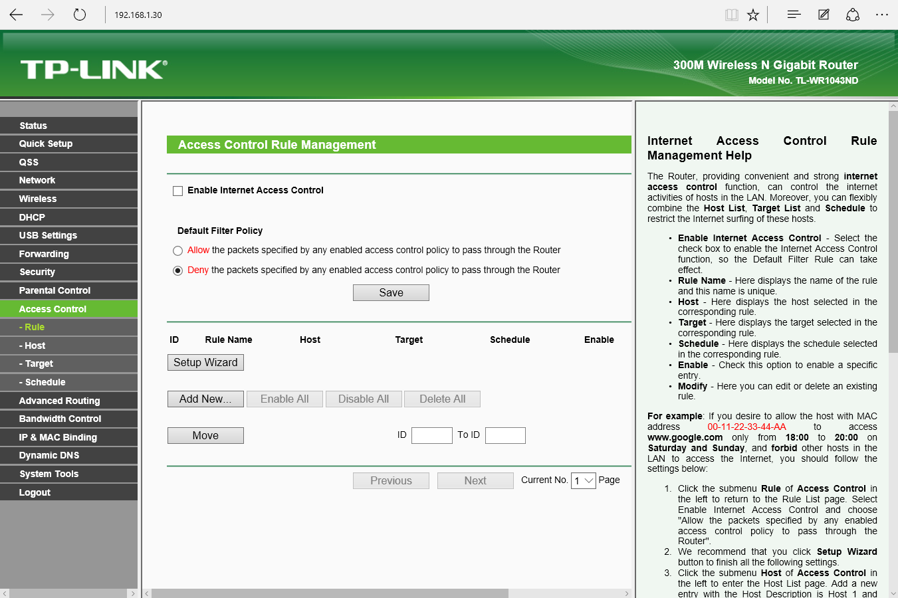
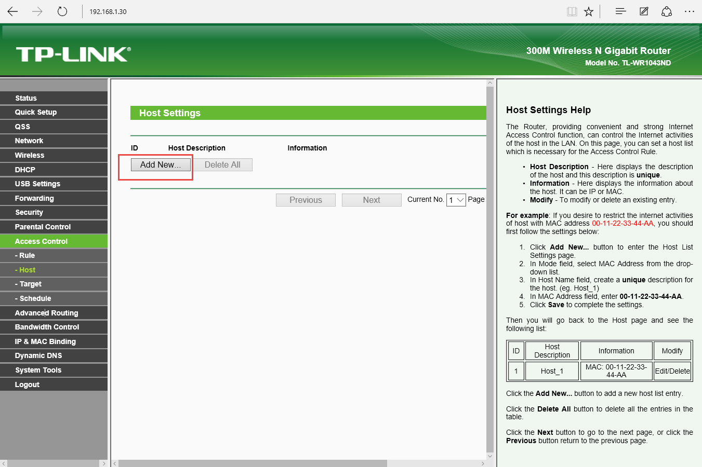
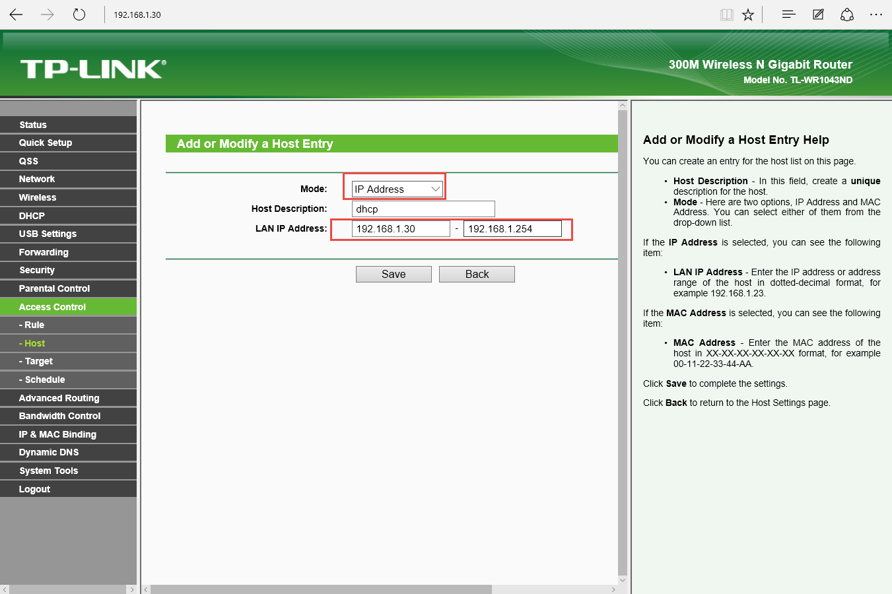
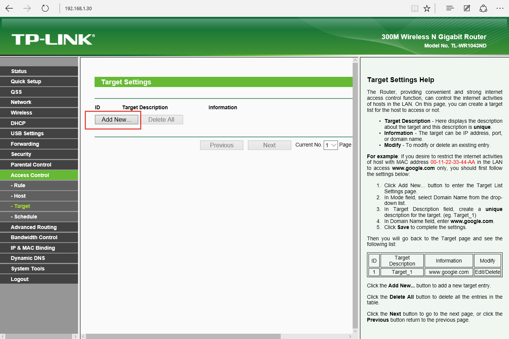
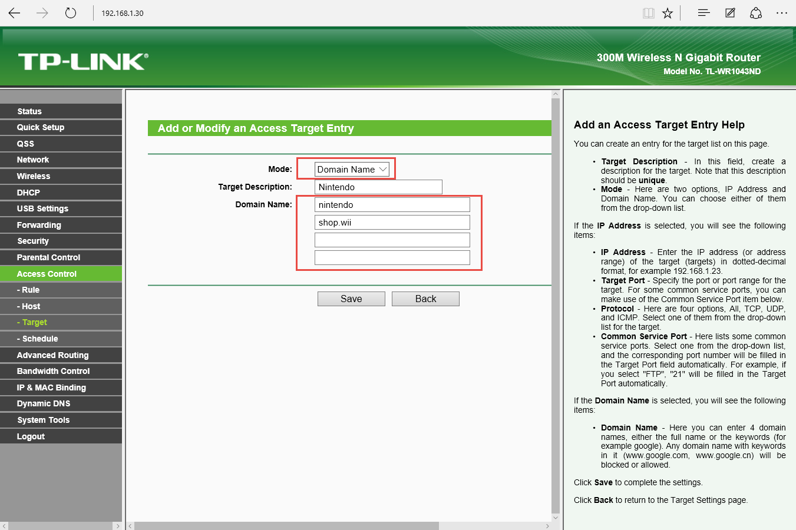
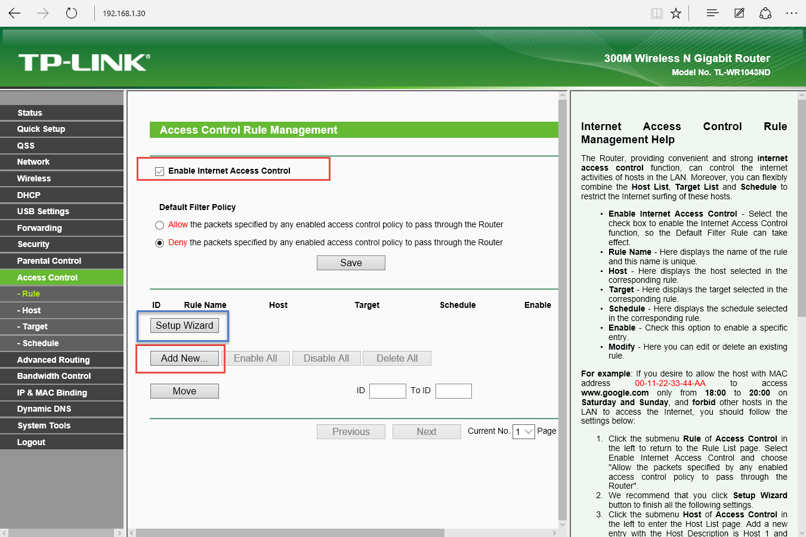
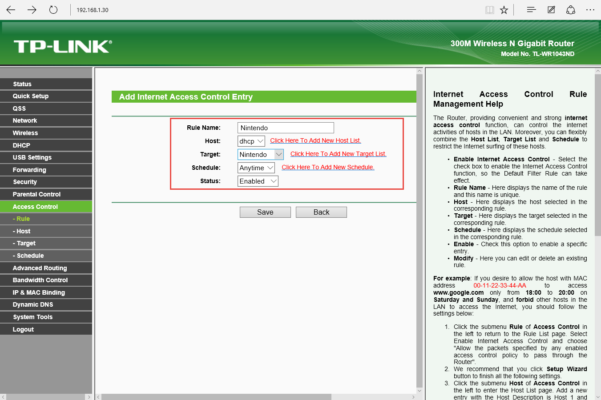
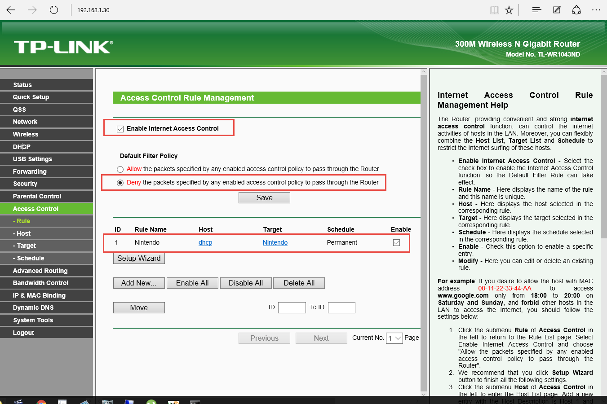
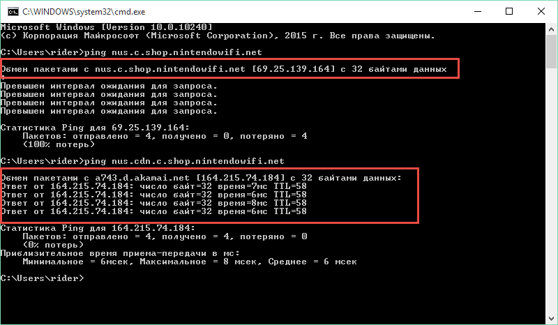
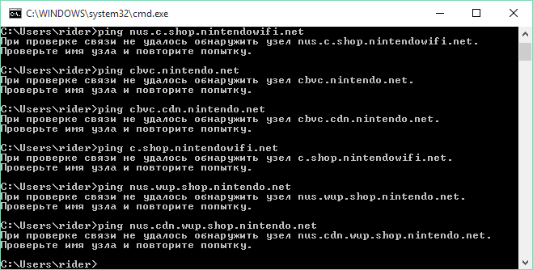

# Блокировка обновлений Wii U
# Вводная часть
Если нет желания читать вводную часть, то переходим непосредственно к разделу **Блокировка ресурсов Нинтендо с помощью функции Acess Control**.

Итак, если вам повезло, и вы "затарились" правильной версией консоли, а это на данный момент версия до 5.4 и если вы хотите играть в скаченные игры, то первое что должно вас волновать это блокировка обновлений вашей консоли. Конечно можно воспользоваться простым способом, то есть при настройке интернета указать первым DNS адресом 107.211.140.065 (TubeHax DNS), а второй не заполнять. Такой финт вроде как считается безопасным и обрезает доступ к обновлениям, во всяком случае я не слышал о том, чтобы у кого-то при таком раскладе консоль обновилась.

Но, пусть это даже немного параноидально, я не слишком доверяю в таких вопросах сторонним сервисам и поэтому решил подстраховаться и дополнительно заблокировать доступ к списку доменных имен, причастных к обновлениям. Список который предлагают на различных ресурсах в интернете собственно такой:

1. nus.c.shop.nintendowifi.net
2. nus.cdn.c.shop.nintendowifi.net
3. nus.cdn.shop.wii.com
4. nus.cdn.wup.shop.nintendo.net
5. nus.wup.shop.nintendo.net
6. c.shop.nintendowifi.net
7. cbvc.cdn.nintendo.net
8. cbvc.nintendo.net

Так как у меня на момент покупки Wii U у меня уже была New Nintendo 3ds и вопрос обновлений там пусть не такой острый как с Wii U, но тоже актуальный. Поэтому я собственно изучил сетевую активность 3ds и могу сделать кое-какие выводу. Так как адреса серверов Нинтендо для разных консолей вполне могут частично пересекаться то изучение сетевой активности 3ds вполне может пригодиться при перекрытии кислорода для нашей Wii U. 
Если включить 3ds с настроенным подключением то консоль лезет на следующие доменные имена:

1. conntest.nintendowifi.net
2. l-npns.app.nintendo.net
3. nppl.c.app.nintendowifi.net

Первый адрес conntest.nintendowifi.net очевидно предназначен для проверки коннекта консоли. О назначении двух остальный сложно вообще судить. 

Если зайти в настройки в раздел управления кодом Nintendo, то консоль лезет на такие адреса:

1. conntest.nintendowifi.net.
2. account.nintendo.net.
3. mii-secure.account.nintendo.net.

Одновременно со всем этим консоль постоянно пытается о себе заявить (каждые 10 секунд) посредством UDP протокола на IP 203.180.85.XX по портам из диапазона 50000 ну и по этому же порту получает ответ размером 12 байт. Наверно, это проверка подключения, но не факт.
Если зайти в игру с поддержкой сетевой игры, то при входе в Nintendo Network консоль идет сюда:

1. nncs1.app.nintendowifi.net
2. nncs2.app.nintendowifi.net

Ну как бы пока всё. С сетевой активность устройств от компании Нинтендо мы немного познакомились. Переходим к блокированию ресурсов.  А, ну да. Читатель данной статьи спросит "какого хрена этот параноик нам тут про это пишет, при чем тут вообще 3ds". Так вот, отвечаю, что изучив сетевую активность устройств от компании Нинтендо мы сможем разом заблочить доступ их девайсов к обновлениям и если у вас есть дети например которые играют в 3ds или Wii U, то заблокировав разом обновления мы можем спать спокойно. Да, пока например для 3ds обновления в EmuNAND считаются безопасными, но никакой гарантиии, что так будет всегда нет. Поэтому рекомендую всем подстраховаться.

# Блокировка ресурсов Нинтендо с помощью функции контроля доступа
Итак, переходим непосредственно к блокировке. Сразу отмечу, что для блокировки даже с использованием каких-то мануалов вы должны обладать минимальным набором знаний. Как минимум нужно владеть понятиями IP, шлюз, домен, DHCP. Если эти слова вам ни о чем не говорят лучше попросить помощи у более сведущих знакомых или друзей. 
У многих роутеров уже из коробки есть функционал для блокирования ресурсов по их доменному имени. Называться эта функция может по разному, но суть одна - заблокировать доступ определенному хосту в локальной сети на определенные доменные имена в интернете.
**ВНИМАНИЕ!!! Если ваш роутер умеет блокировать ресурсы только по IP, даже не пытайтесь это настраивать. IP адреса доменов на которые лезет Wii U МЕНЯЮТСЯ, поэтому настроить блокировку можно ТОЛЬКО если ваш роутер умеет блокировать по URL**
**В зависимости от модели и производителя методика блокировки может отличаться, поэтому рекомендую для начала протестировать блокировку на домашнем компьютере и с помощью команды ping убедиться что все адреса заблокировались.**

Все манипуляции я буду производить на роутере TP-Link 1043 v1 с версией прошивки 3.13.15 Build 140319 Rel.41339n. На других роутерах TP-Link инструкция тоже может быть актуальна.

Я являюсь счастливым обладателем маршрутизатора TP-Link 1043 v1 и меня данный маршрутизатор всем устраивал, пока я не попытался настроить вышеупомянутую функцию дабы подстраховаться на случай если TubeHax DNS не сработает.
Начиналось все весьма радужно. Погуглив я сразу нашел официальный мануал.
http://www.tp-linkru.com/faq-273.html
Но например у меня лично воспользоваться мануалом не вышло, так как в моей версии прошивки все выглядело и работало не как по мануалу.
Поэтому если у вас что-то пойдет не так предлагаю свой мануал.
Входим в web-интерфейс нашего роутера и заходим в раздел DHCP.Нам необходимо определить диапазон IP-адресов, которые выдает роутер новым устройствам при подключении.

Как видим, в данном конкретном случае этот диапазон 192.168.1.100 - 192.168.1.254.
Далее заходим в раздел "Acess control" (в русской версии "Контроль доступа").

По умолчанию данная функция отключена. Можно конечно сразу ее включить, но предлагаю оставить это на потом, так как пока у нас нет правил для блокировки.
Определяем список IP-адресов нашей сети, на которые будет распространяться наши блокировки.Для этого заходим в подраздел "Host" и добавляем новую запись.

Наша новая запись должна содержать диапазон IP адресов, для которых блокировка будет работать. ТАк как мы ранее определили, что диапазон адресов, который выдает наш DHCP сервер 192.168.1.100 - 192.168.1.254, то будем считать, что для всех этих устройств будет работать наша блокировка.

В данном случае я дополнительно расширил диапазон IP, который начинается в примере с 30 адреса. Можете вообще указать полный диапазон 192.168.1.1 - 192.168.1.254, тогда под блокировку попадут все устройства вашей локальной сети.
Далее нам необходимо определить правило, которое укажет какие именно адреса нужно блокировать. Переходим в подраздел Target (Цель) и добавляем новую запись.

Обязательно выбираем режим Domain Name и еще раз вспоминаем что **блокировка по IP БЕСПОЛЕЗНА**

В поля с доменными именами мы должны вписать ключевые слова для блокировки. Если вы например напишите в поле nintendo, то это заблокирует доступ ко всем доменным именам где встречается слово nintendo.
Внимательно изучив список адресов для блокировки мы можем сделать вывод, что для блокировки всех адресов достаточно ввести всего два слова nintendo и shop.wii. Можно подойти к делу более творчески и вводить более узкие критерии, типа nus.cdn.c.shop или nus.c.shop. Естественно вы можете сделать не одну целевую запись, а несколько, если например вам не хватает 4 полей для определения всех ключевых слов для блокировки. Но в данном примере будем использовать только одну такую целевую запись.
**ВНИМАНИЕ!! Тут есть одна хитрость!  И сейчас скажу какая. Если внимательно посмотреть список первых 8 доменных имен для блокировки, то для блокировки достаточно использовать слова shop.nintendo, что я изначально и сделал. Но выяснилось, что если так сделать то блокировка ресурсов типа shop.nintendowifi.net НЕ РАБОТАЕТ, хотя если просто указать nintendo, то все блокируется. Поэтому, чтобы все заблокировалось нужно будет добавить запись типа shop.nintendowifi. Так что не ленитесь проверять работоспособность блокировки.**
После того как запись создана переходим непосредственно к созданию правила для блокировки, а для этого заходим в подраздел Rule (Правило).

Включаем контроль доступа, ставя галку и добавляем новое правило. Можно конечно воспользоваться кнопкой мастера, но, ну не люблю я корочеэти мастеры. Поэтому просто добавляем новое правило.

Выбираем наш хость, цель. Если целевых записей создано несколько, то на каждую цель сделайте отдельное правило.Сохраняем правило и по скриншоту проверяем, что все у нас правильно сделано.

**Далее нам необходимо проверить, что наше правило работает. Это можно сделать с помощью компьютера, IP адрес которого входит в блокируемый диапазон локальных адресов.**
Команда ping позволяет проверить доменное имя или IP на доступность.В случае если проверяется доменное имя, то при выполнении команды ping сначала запрашивается IP-адрес указанного доменного имени от DNS сервера.
Поэтому, при выполнении команды ping проверям чтобы даже IP-адрес НЕ ВЫДАВАЛСЯ. Это как-раз и позволит нам сделать заключение, что блокировка сработала.
Вот так выглядит результат команды ping без блокировки

На скриншоте видно, что были выполнены две команды. В первой на команду сервер не ответил, но как мы видим IP-адрес был успешно получен.
А вот так будет выглядеть результат команды с уже добавленными блокировками

Как мы видим на скриншоте, ни одна команда пинг не сработала и IP-адрес не был полечен. Такой результат нужно проверить по каждому блокируемому адресу.

Отключите наше правило и проверьте, что команда ping опять работает. Затем включите и работать ничего уже не не должно. Так вы точно убедитесь, что блокировка работает. Для достоверности эксперимента можно перед проверкой очищать кэш DNS командой ipconfig /flushdns. Это позволить убедиться что IP адрес не взялся из кэша, а получен именно от роутера.
Ну вот вроде как и все. Не ленитесь и будьте внимательны и осторожны. Так вы и ваши близкие смогу получать удовольствие в виде бесплатных игр гораздо дольше. )

